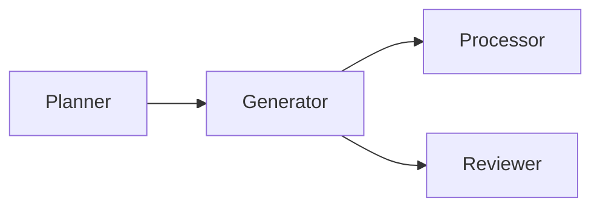
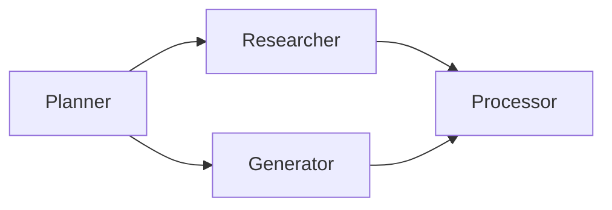

# Agent Team Canvas DAG Design

## Goal

Build the first practical version of the Agent Team Canvas using the approved B approach: a visual connection canvas where the fixed Planner root receives the user task, and user-created joints run according to the graph connections.

## Confirmed Product Direction

The first version focuses on making the orchestration visible and directly editable without changing unrelated chat or task logic.

- The homepage empty state and mode switcher remain the lightweight Hermes-style layer already added.
- The multi-model and task orchestration monitor becomes an editable canvas.
- The canvas supports adding, editing, deleting, dragging, and connecting joints.
- Clicking a joint opens a dialog for editing its name, role, model, skill prompt, output format, enabled state, and permissions.
- Creating a joint also uses the same dialog.
- The Planner joint is the fixed root and top-level task receiver.
- Execution follows the graph drawn by the user.
- Multi-output edges run in parallel after the upstream joint completes.
- Multi-input joints wait for all upstream joints, then receive a merged upstream context.

## Non-Goals For This Version

- No free-form cyclic workflows. Cycles are blocked.
- No automatic agent planning that rewires the graph by itself.
- No marketplace or template library for joints.
- No nested subgraphs.
- No new landing page or marketing-style UI.
- No broad replacement of the existing Work Agent streaming flow beyond what is needed to run the graph.

## User Model

A user starts with Planner as the required head joint. They add joints such as Generator, Researcher, Processor, Reviewer, or Publisher. They connect nodes visually:

In this example, Planner runs first. Generator receives Planner output. Processor and Reviewer both receive Generator output and run in parallel.

For a multi-input join:

Processor waits until both Researcher and Generator complete, then receives a structured context containing both outputs.

## Data Model

The existing `AgentSlot` remains the primary joint definition:

- `id`
- `name`
- `role`
- `model`
- `skill`
- `permissions`
- `outputFormat`
- `isEnabled`

Add graph-specific state to each chat:

- `agentGraph.positions`: maps `agentId` to `{ x, y }`
- `agentGraph.edges`: stores directed edges `{ id, from, to }`

The Planner slot keeps its existing `id` and is treated as the fixed root. It may be edited for model, prompt, and role wording, but cannot be deleted and cannot have incoming edges.

## Canvas Rules

- A user can add a new joint from the canvas toolbar.
- A user can delete non-Planner joints.
- Deleting a joint removes all incoming and outgoing edges for that joint.
- A user can drag joints and their positions persist in chat state.
- A user can connect one joint to another.
- Duplicate edges are ignored.
- Self-edges are blocked.
- Edges into Planner are blocked.
- Any edge that would create a cycle is blocked.
- Disabled joints appear muted and are skipped during graph execution.
- Edges connected to skipped joints do not produce downstream input from that skipped joint.

## Execution Semantics

The graph executor computes topological levels from Planner outward.

1. Start with Planner.
2. Run all joints in the current level.
3. When a joint completes, store its output by joint id.
4. A downstream joint becomes runnable only when all enabled upstream joints have completed.
5. All runnable joints in the same level run concurrently.
6. A joint receives:
   - the original user task,
   - its own role and skill prompt,
   - its selected model,
   - a structured list of upstream outputs,
   - the current graph path context.
7. The final response is composed from terminal joints, meaning enabled joints with no enabled outgoing edges.

If a joint fails, the graph run marks that joint as failed and does not run downstream joints that depend on its output. Independent branches continue running.

## UI Design

The first version keeps the existing monitor panel shape and upgrades the inner canvas.

Controls:

- Add joint button.
- Connect mode toggle.
- Delete selected button for selected non-Planner joint or selected edge.
- Auto-layout button.
- Close button.

Joint node:

- Circular or compact rounded node, matching the selected B visual direction.
- Shows name, short role, model label, and status indicator.
- Has visible input/output hook targets.
- Click opens the edit dialog when not in connect mode.
- Drag changes position.

Edit dialog:

- Name input.
- Role input.
- Model selector.
- Skill prompt textarea.
- Output format textarea.
- Permission toggles.
- Enabled toggle.
- Save and cancel actions.
- Delete action only for non-Planner joints.

Edge interaction:

- In connect mode, click source joint, then click target joint.
- Existing edge can be selected and deleted.
- Invalid connection attempts show a small inline message inside the panel.

## Backend And Streaming

The first runnable graph implementation should reuse the existing Work Agent request path where possible, but add a graph-level orchestration wrapper.

The wrapper emits NDJSON-style events:

- `graph-start`
- `joint-start`
- `joint-token` or `joint-output`
- `joint-complete`
- `joint-error`
- `graph-complete`

The frontend uses those events to update joint statuses on the canvas. Existing single-agent chat streaming remains available for non-graph modes.

## Testing Strategy

Unit tests cover graph rules:

- Planner cannot be deleted.
- Incoming edges to Planner are blocked.
- Duplicate edges are ignored.
- Self-edges are blocked.
- Cycle-creating edges are blocked.
- Deleting a joint removes related edges.
- Multi-output graph produces parallel runnable levels.
- Multi-input graph waits for every enabled upstream joint.
- Disabled joints are skipped.

Component tests cover the canvas:

- Add joint opens dialog and saves a new joint.
- Clicking a joint opens edit dialog.
- Connect mode creates an edge from selected source to selected target.
- Deleting a selected edge removes it.
- Dragging persists a node position.

Integration tests cover graph streaming:

- A simple Planner to Generator graph runs in order.
- A Planner to Generator and Researcher graph starts both children after Planner.
- A failed branch marks dependent downstream joints as skipped while independent branches continue.

## Rollout

Implementation should be split into two checkpoints:

1. Editable canvas: add, edit, delete, drag, connect, validate, and persist graph state.
2. Runnable graph: execute joints according to the DAG and stream joint statuses.

This keeps the first visible improvement reviewable while still preserving the requirement that joints become independently runnable after the canvas model is in place.

## Self-Review

- No incomplete markers remain.
- Planner root behavior is explicit.
- Multi-output and multi-input execution semantics are explicit.
- The scope is focused on one feature area: editable orchestration canvas plus graph execution.
- Invalid graph behavior and failure behavior are defined.
